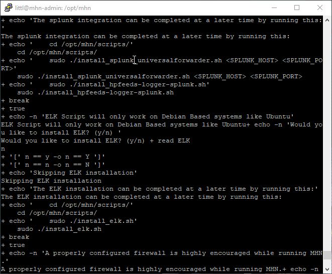

# Honeypot Assignment

**Time spent:** **20** hours spent in total

**Objective:** Create a honeynet using MHN-Admin. Present your findings as if you were requested to give a brief report of the current state of Internet security. Assume that your audience is a current employer who is questioning why the company should allocate anymore resources to the IT security team.

--- 
### MHN-Admin Deployment (Required)

**Summary:** How did you deploy it? Did you use GCP, AWS, Azure, Vagrant, VirtualBox, etc.?

To deploy MHN-Admin, I used GCP. For the most part, I followed the steps CodePath provided. However, there were many issues I encountered when using Google Cloud that took a very long time for me to figure out and caused me to add additional steps to make the VM possible to deploy. For example, I found out that I could not create a GCP Free Tier account with my FAU Google school account; trying to create firewall rules with that account was impossible. I winded up completely deleting the project I had made with that account, and I instead redid the whole setup process with one of my personal Google accounts. This fixed the problem I had creating firewall rules, but then creating the VM also started causing problems. For many of the zones I configured, they kept saying that those zones' resource pools were exhuasted. After changing the region and zone for the instance about rouighly 10 times, I finally found one zone (us-west1-b) that worked. Once I got past this step, I was able to get the external IP and put this in a browser to prove that the MHN Admin application was working.

Above is a gif that shows proof of the deployed MHN Admin page and also shows the command prompt and VM in Ubuntu that got me to deploying it. 

---
### Dionaea Honeypot Deployment (Required)

**Summary:** Briefly in your own words, what does dionaea do?

Dionaea is a type of honeypot, specifically a low-interaction honeypot. The purpose of low-interaction honeypots is to collect basic information about the attacker of a system. Low-interaction honeypots are typically easy to setup and are most commonly used. Dionaea specifically is meant to capture information about malware that is exploiting things over a network. 

Above is a gif that shows proof that I set up the honeypot VM. The gif also shows the honeypot under Sensors >> View sensors in MHN Admin application. 

---
### Database Backup (Required) 
**Summary:** What is the RDBMS that MHN-Admin uses? What information does the exported JSON file record?

The RDBMS that MHN-Admin uses is MongoDB, which uses a JSON structure. The exported JSON file records the data collected from the connected honeypots. The longer the honeypots are running, the more information the JSON file will have. This is why it may be necessary to apply a truncate command on the JSON file before uploading it to GitHub or storing it elsewhere. I, unfortunately, after several hours of trying to figure out a solution, could not generate the JSON file. I kept getting an error that said "-bash: session.json: Permission denied". The gif below shows this error that I could not get past in the mhn-admin VM for reference.

## Notes

Describe any challenges encountered while doing the assignment.
- As aforementioned, I had many issues with the setup that took a while to figure out.
    - The first challenge I had with the assignment was getting a GCP account and project working that would allow me to create the necessary firewall rules for the mhn-admin VM.
    - I had to completely delete a GCP project I created with my FAU Google school account because it was not allowing me to create firewall rules with that account.
        - I instead had to use a personal Google account. I redid all of the setup steps to make it work. After this point, I ran into an issue with the Google itself and had to change the zone and region multiple times, as I described above.
- The last issue I had was getting the JSON file. Unlike the other issues, I could not solve this issue. The `mongoexport --db mnemosyne --collection session > session.json` line did not work in my mhn-admin VM for getting the honeypot information. I tried researching for solutions for several hours and had no luck finding something applicable to my case. 
