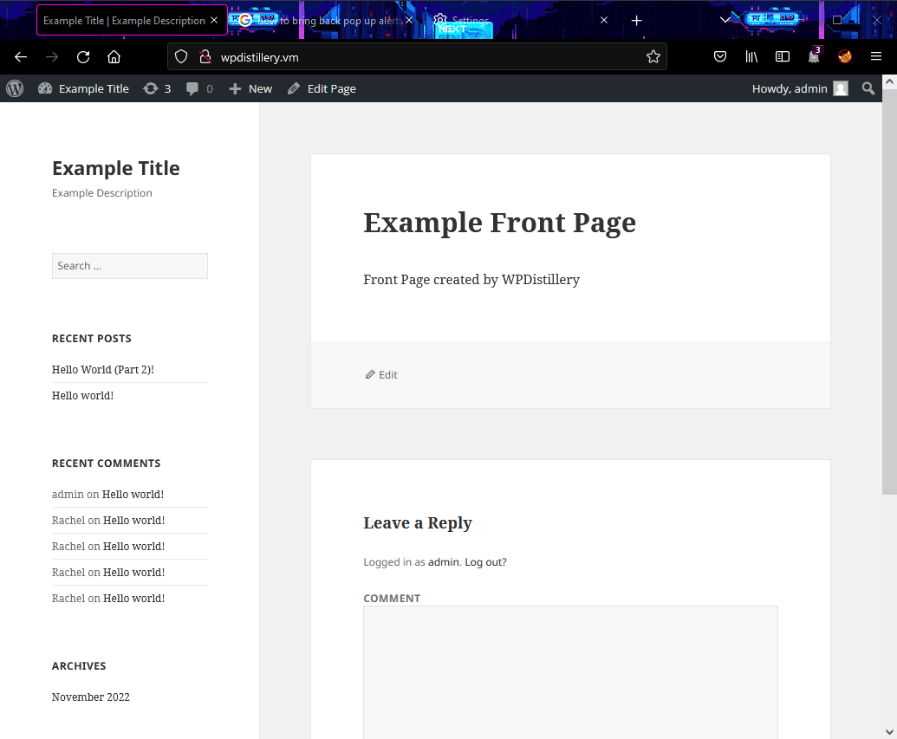

# Project 7 - WordPress Pen Testing

Time spent: **15** hours spent in total

> Objective: Find, analyze, recreate, and document **three or more vulnerabilities** affecting an old version of WordPress

## Pen Testing Report

### 1. (Required) WordPress <= 4.2.3 - Legacy Theme Preview Cross-Site Scripting (XSS)
CVE-2015-5734
- [x] Summary: 
  - Vulnerability types: XSS
  - Tested in version: 4.2 
  - Fixed in version: 4.2.4
- [x] GIF Walkthrough: 

- [x] Steps to recreate: When logged into your administrator account, navigate to a post and leave a comment. The comment should be the link shown in the GIF. You can also find the script for the comment [here](exploit_1_code.txt). When this HTML hyperlink is posted, it will prompt an alert that constantly continues to pop up when the user scrolls up to a certain area of the website.
- [x] Affected source code:
  - [Link 1](https://core.trac.wordpress.org/changeset/33549/branches/4.2/src/wp-includes/theme.php)
  
 
### 2. (Required) WordPress 3.7-4.4 - Authenticated Cross-Site Scripting (XSS)
CVE-2016-1564
- [x] Summary: 
  - Vulnerability types: XSS
  - Tested in version: 4.2
  - Fixed in version: 4.2.6
- [x] GIF Walkthrough: 

- [x] Steps to recreate: When logged into your administrator account, navigate to a post and leave a comment. The comment should be the link shown in the GIF. You can also find the script for the comment [here](exploit_2_code.txt). When this HTML hyperlink is posted, it will prompt an alert that pops up every time the website is loaded.
- [x] Affected source code:
  - [Link 1](https://core.trac.wordpress.org/changeset/36185/trunk/src/wp-includes/class-wp-theme.php)

### 3. (Required) WordPress <= 4.2 - Unauthenticated Stored Cross-Site Scripting (XSS)
CVE-2015-3440
- [x] Summary: 
  - Vulnerability types: XSS
  - Tested in version: 4.2
  - Fixed in version: 4.2.1
- [x] GIF Walkthrough: 

- [x] Steps to recreate: In order to execute the exploit, a user account must post an extremely long comment that is a link, such as shown in the first GIF. This comment must be extremely large so that an alert will constantly appear whenever the user is on the webpage. This alert is written in the HTML<a> link, as shown in the GIF. The alert displays “hello world”. It is important to note that, for a user account to create this exploit comment, that particular user must be approved by an administrator account to post comments. Once an administrator account has approved the user, the user can comment freely without having to wait again for admin approval. In the exploit demo GIF (the first GIF), the fake user "Rachel" was already approved by admin; this was to ensure that hte GIF did not record for too long. However, I included how to execute this approval process in the second GIF.
- [x] Affected source code:
  - [Link 1](https://core.trac.wordpress.org/changeset/32299/trunk/src/wp-includes/wp-db.php)

## Assets

List any additional assets, such as scripts or files.
- Any scripts that I used are contained in this repo and linked to in the recreation steps for these exploits. 

## Resources

- [WordPress Source Browser](https://core.trac.wordpress.org/browser/)
- [WordPress Developer Reference](https://developer.wordpress.org/reference/)

GIFs created with ShareX (14.1).
<!-- Recommended GIF Tools:
[Kap](https://getkap.co/) for macOS
[ScreenToGif](https://www.screentogif.com/) for Windows
[peek](https://github.com/phw/peek) for Linux. -->

## Notes

Describe any challenges encountered while doing the work.
- One large challenge I had was trying to set up WordPress. 
  - I had difficulty actually getting the WordPress website up and running on a browser on both my local host machine and my Kali Linux VM. In order to fix this issue, I had to fix the config file within the WPDistillery folder I created in my $HOME directory on my local host machine. 
