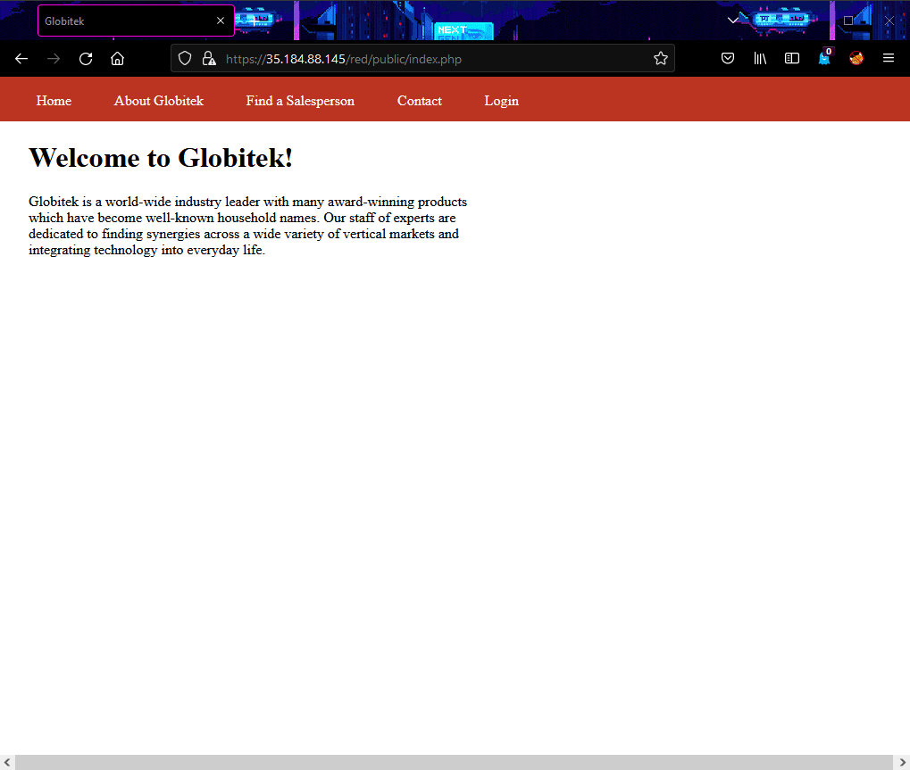

# Pen Testing Live Targets

Time spent: **8** hours spent in total

> Objective: Identify vulnerabilities in three different versions of the Globitek website: blue, green, and red.

The six possible exploits are:

* Username Enumeration
* Insecure Direct Object Reference (IDOR)
* SQL Injection (SQLi)
* Cross-Site Scripting (XSS)
* Cross-Site Request Forgery (CSRF)
* Session Hijacking/Fixation

Each color is vulnerable to only 2 of the 6 possible exploits. First discover which color has the specific vulnerability, then write a short description of how to exploit it, and finally demonstrate it using screenshots compiled into a GIF.

## Blue

**Vulnerability #1**: __________________

**Description**:

## Green

### Vulnerability #1

### Description

### Vulnerability #1

### Description

## Red

### Vulnerability #1
Insecure Direct Object Reference (IDOR) 

### Description
The red site has a vulnerability that the other two websites (the green and blue sites) do not have. If you navigate to the “Find a Salesperson” area on any of the three sites and click on a person in the list, you will notice (as shown in the GIF) that the ID of the employee is located in the URL. For the green and blue sites, if you try to change the ID to that of an employee whose information should not be accessible, the site will simply kick you back to the “Find a Salesperson” main menu. However, if you try to perform the same test on the red site, you will see some sensitive employee information that should not be made publicly available. For example, if you change the ID to 10 (as shown in the GIF), you will see an employee named Testy McTesterson whose data should not be made available until September 1st. Another example is if you change the ID to 11 (as shown in the GIF); you will see an employee named Lazy Lazyman who was fired for stealing and who should not be accessible.

### Vulnerability #2
Cross-Site Request Forgery (CSRF) 

### Description

## Notes

Describe any challenges encountered while doing the work
